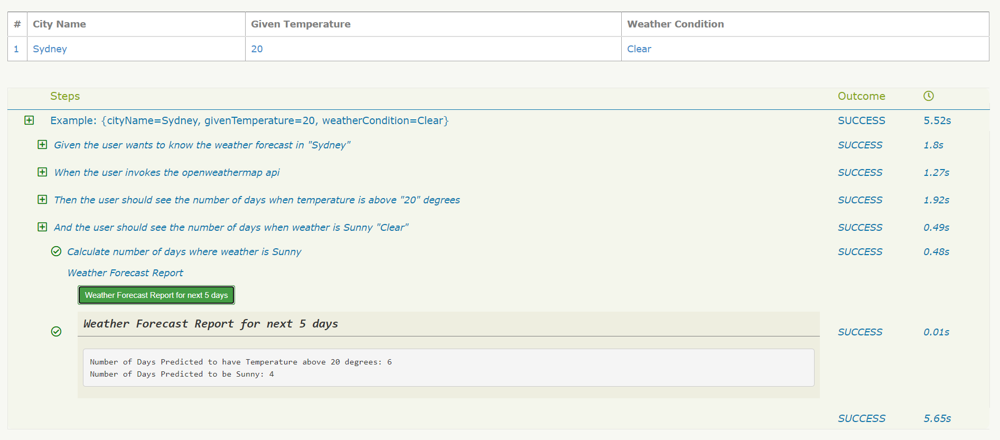

**Weather Forecast Report**
***
**Framework** - This API test framework in Java language using libraries like restAssured (for API), Cucumber (for BDD) and Serenity along with MAVEN.
***
**Pre-requisites** - <br />
* Java installation (Download [JAVA](https://www.oracle.com/au/java/technologies/javase-downloads.html) based on OS).
* Configure JAVA_HOME under Environment variables.
* Install IDE - Eclipse or IntelliJ based on your choice.
* Create free account for [openweathermap](https://openweathermap.org/) and generate "API_Keys". Note - For assessment review purpose, the API_Key has been kept in the script.
***
**How to setup** - <br />
* Clone the source code from git as per below command. <br />
```git clone```
* Import the Project into IDE
* Resolve all pom.xml dependencies by installing all the libraries. It can be resolved automatically using tool or use below command.
<br />```mvn clean install```
***
**How to run tests and generate reports**
Run CLI ```mvn test verify``` to build, execute and aggregate the serenity report.<br />
```aidl
mvn test verify
```
Note -
* Make sure to select the root directory before execution.
* This command will only run the scenarios in feature file with tag as "@test".
* Feature file path - ./src/test/resources/features folder.
* Output folders - ./target (first time this folder will be auto genrated)
***
**Where to find results under HTML report**
The html report will be generated on below path.<br />
```./target/site/serenity/index.html```

**Example Test Execution Summary**


Navigation - <br /> 
```
HTML Report Home --> Overall Test Results Tab --> Click Test results Tab --> Click Scenario --> Expand Steps to see the Test Outcome 
```